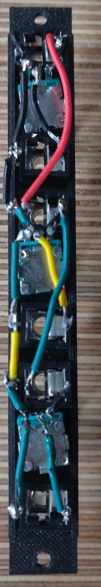

# Multiple Attenuator

### Description

* Uses potentiometers to adjust the attenuation on input jacks before sending them to output jacks (space for three input, potentiometer, output groups)
* Passive model only allows attenuation of the signal (no positive gain)
* The input jacks are normaled from top to bottom, so if nothing is plugged into it, the jacks will receive input from the one above it

### Schematic

### Advice

* Connect all grounds together, connect each input jack to potentiometer and next input jack’s switch, connect potentiometer output to output jack’s input

* The potentiometer direction is important, as when the pins are facing up and you’re looking at the back, the left pin is ground, the middle is the output, and the right pin is the original signal

* Potentiometer holes need to be drilled out, drill from the back for a neater hole

### Front Face

## Back Face

## Potential Variations

* Having potentiometers between jacks makes the knobs hard to twist when both jacks are plugged in, could be worth moving all potentiometers to the bottom
