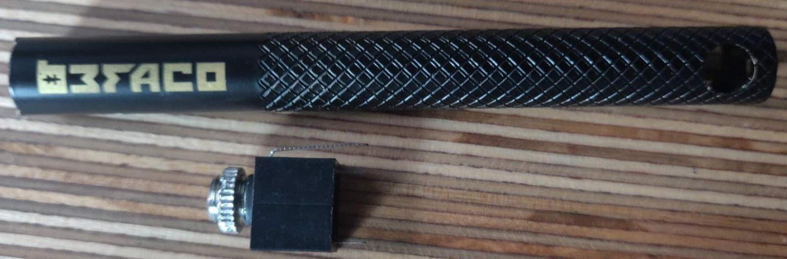
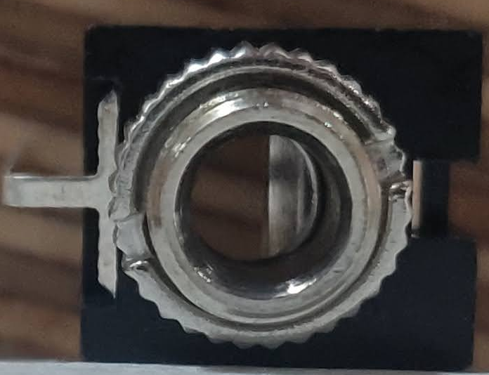
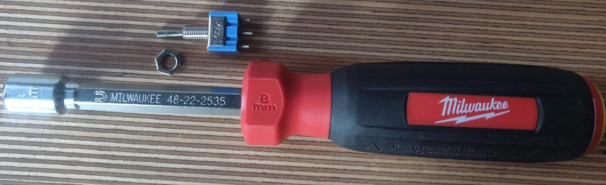
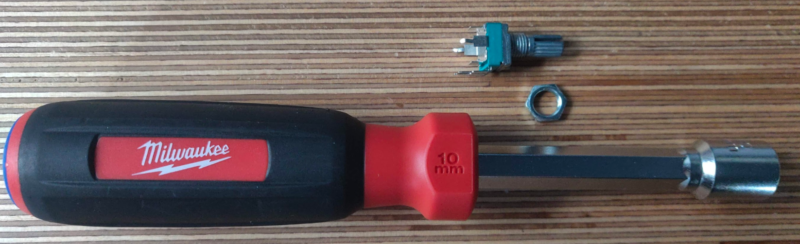

# General Advice
* For standard 3.5mm jacks, use this tool to tighten the front (in the screw cabinet):

* Notches in the tool go into two notches in the washer:

* For switches, use an 8mm hex screwdriver to tighten the front (in the socket cabinet):

* For potentiometers, use a 10mm hex screwdriver to tighten the front (in the socket cabinet):

* To make insulated short cables, it’s often easier to strip both ends of a longer cable and cut it down rather than trying to strip down short cables from the start
* Twisting and tinning stranded wire before soldering will make your connections neater
