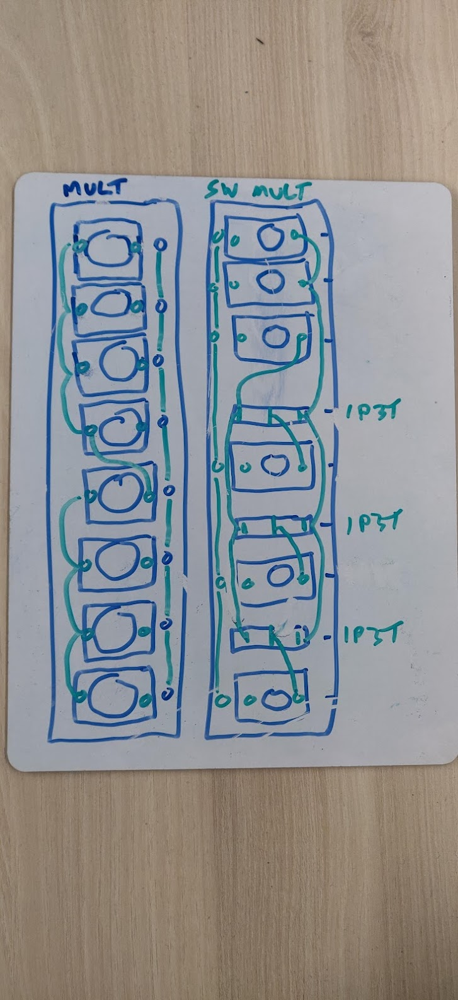
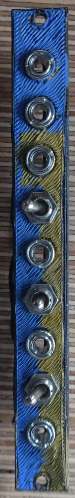
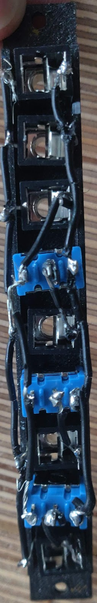

# Multiplier and Switched Multiplier

##Description

* Standard multiplier connects everything together, while switched multiplier combines certain jacks together depending on whether the switch sends the signal left or right (with the switch in the middle leading to the correlated jack not outputting at all)

##Schematic

## Front Face

## Back Face

## Potential Variations

* Different arrangements of jacks and switches may make it easier to access them when cables are plugged in
